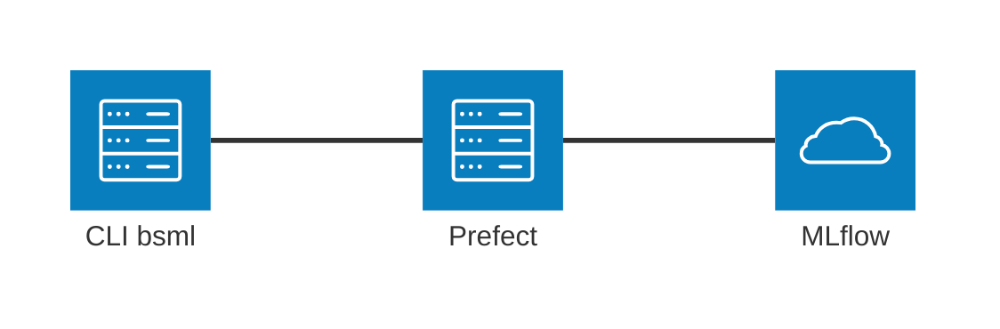
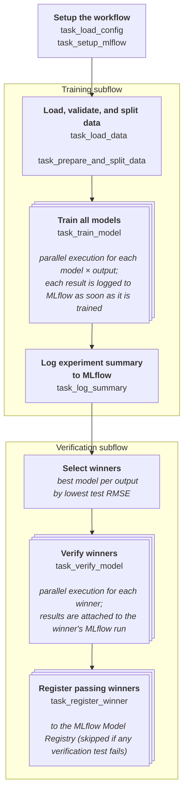

# Workflow architecture

The main architectural dependencies of this project are:

- [Prefect](https://www.prefect.io/) for workflow orchestration
- [MLflow](https://mlflow.org/) for experiment tracking and model registry

The pipeline implements a **train → compare → verify → register** lifecycle:
every configured model is trained for every output variable, the best model per
output (lowest test RMSE) is selected as the *winner*, the winners undergo a
suite of verification tests, and only winners that pass **all** tests are
automatically registered in the MLflow Model Registry.

## Prefect workflows

Three Prefect flows are defined in `bonestrength_ml/workflows/flows.py`, each
mapped to a CLI invocation:

| Flow | CLI invocation | Behavior |
|------|----------------|----------|
| `train_all_outputs_flow` | `bsml train` | Trains every configured model for both output variables, verifies and registers the per-output winners. |
| `train_single_output_flow` | `bsml train --output X` | Trains every configured model for one output (`maxStrain_11` or `maxStrain_33`), verifies and registers the winner. |
| `train_specific_model_flow` | `bsml train --output X --model Y` | Trains one model for one output. Debug/retrain shortcut: **no verification, no registration**. |

The first two flows accept `--skip-verification` to stop after training (and
therefore skip registration too).

Let's take a closer look at the full workflow `train_all_outputs_flow`; the
other two are simplified versions of it.

After loading the configuration and initializing
MLflow tracking, the dataset is loaded, validated, and split into per-output
train/test sets. The **training subflow** then starts: one training task per
model × output combination runs in parallel, and each logs its results to
MLflow independently; when all have finished, a summary run comparing them is
logged. The **verification subflow** narrows the field: the best model per
output (lowest test RMSE) is selected as the winner, each winner is put through
the configured verification tests in parallel, and winners that pass every test
are registered in the MLflow Model Registry. Each box in the diagram lists the Prefect tasks involved, which are described next.

### Tasks

The tasks (defined in `bonestrength_ml/workflows/tasks.py`) are thin Prefect
wrappers around the library code in `bonestrength_ml/training/`,
`bonestrength_ml/verification/`, and `bonestrength_ml/data_loading.py`:

| Task | Purpose | Notes |
|------|---------|-------|
| `task_load_config` | Load and validate the YAML configuration with Pydantic | |
| `task_setup_mlflow` | Set the MLflow tracking URI and create/select the experiment | |
| `task_load_data` | Load the CSV dataset and validate it with Pandera | 1 retry with 5 s delay |
| `task_prepare_and_split_data` | Project the dataframe into features/targets and build the per-output train/test splits | |
| `task_train_model` | Train one model for one output (with hyperparameter search) and log it to MLflow | 2 retries with 10 s delay; tagged `training`; submitted with `.submit()` for parallel execution |
| `task_log_summary` | Log a single MLflow run comparing all trained models | |
| `task_verify_model` | Run every configured verification test on a winner and attach the report to its MLflow run | Tagged `verification`; submitted with `.submit()` |
| `task_register_winner` | Register the winner's model in the MLflow Model Registry **iff** all verification tests passed | |

Parallelism is fan-out/fan-in: every `task_train_model` is submitted as a
Prefect future (one per model × output combination), and the flow blocks on
`.result()` only when it needs the trained models to build the summary and pick
winners. Verification runs the same way, one future per winner.

## Verification suite

Verification (`bonestrength_ml/verification/`) is a pluggable, registry-based
suite inspired by the ASME V&V 40 standard:

- **`registry.py`** maps a YAML `type` name to a check implementation. Test
  modules self-register at import time via `register("<name>", <check_fn>)`,
  so adding a new test requires no changes to the flows, MLflow logging, or
  CLI — only a new module and a YAML entry.
- **`base.py`** defines the contract: every check is a callable taking a
  `VerificationContext` (winning model, full `X`/`y`, config entry, seed) and
  returning a `TestResult` (`passed` flag plus metrics/params/details). Results
  are aggregated into a `VerificationReport`, whose `all_passed` property gates
  registration.
- **`verify.py`** is the orchestrator: it runs every test declared in
  `verification.test_list` of the configuration, in order. It is a pure
  function — MLflow logging happens separately in the task.

Currently implemented checks:

- **`convergence`** (`convergence.py`): retrains the winning model's
  configuration on growing subsets of the training data (`n_rows` parameter)
  and measures the Mean Relative Error of each subset model's predictions
  against the winner's predictions on a Latin Hypercube sample of the input
  space. Passes if the error drops below the threshold and stays below it for
  all larger subset sizes; also reports the minimum converging training size.
- **`smoothness`** (`smoothness.py`): perturbs each input dimension of a
  Latin Hypercube sample by a fraction of its configured range and computes a
  normalized partial derivative (Maximum Relative Error Ratio). Passes if the
  maximum ratio stays below the threshold, i.e. the surrogate's response
  surface has no spurious oscillations.

Both tests evaluate the model on synthetic points generated by
**Latin Hypercube Sampling** (`latin_hypercube.py`), which covers the input
space defined by the per-field ranges in the dataset configuration rather than
relying only on the observed data.

## MLflow integration

MLflow utilities live in `bonestrength_ml/training/mlflow_utils.py`. By default
tracking uses a local SQLite backend (`sqlite:///mlruns.db`) under the
`BoneStrengthML` experiment; both are overridable via CLI options.

- **One run per trained model.** `task_train_model` logs its own run
  (parameters, train/test metrics, the fitted model with an inferred signature,
  and the cross-validation results as a CSV artifact) as soon as that model
  finishes training, so runs become observable in parallel rather than only
  after the whole batch completes.
- **One summary run per experiment.** Once every model has been trained,
  `task_log_summary` adds a single `experiment_summary` run with a comparison
  table of all models and the best model/RMSE per output.
- **Verification results attached to the winner's run.** `task_verify_model`
  resumes the winner's existing run and adds per-test metrics, params, and
  pass/fail tags (`verification.<test>`, `verification.status`), plus the full
  structured report as a `verification/report.json` artifact.
- **Conditional registration.** `task_register_winner` registers the winner's
  logged model under the name `BoneStrengthML_{output}_{model_label}` in the
  MLflow Model Registry, but only if `report.all_passed` is true.

## CLI

The workflows are executed through a CLI defined in `bonestrength_ml/cli.py`
using **Typer**, with **Rich** for formatted console output. Besides `train`
(see the flow table above), the CLI provides `list-models` (shows the
configured models and their hyperparameter search spaces) and `mlflow-ui`
(starts the MLflow UI against the local tracking database).

## Configuration

Workflows in this project are configuration-driven. A single YAML file,
`config/BoneStrengthML.yml`, drives all three workflows. It is loaded and
validated using **Pydantic** models (`bonestrength_ml/config.py`) at the
beginning of each workflow, so a malformed configuration fails fast. It
specifies:

- **`dataset`**: path, CSV format metadata, and the full schema of input/output
  fields (name, type, valid range, units) used for both data validation and
  Latin Hypercube sampling;
- **`model_building`**: train/test split settings, preprocessing flags, the
  global hyperparameter-optimization settings (search method, CV folds, …),
  and the list of models to train — each with its hyperparameter grid and an
  optional per-model optimization override;
- **`verification`**: the list of verification tests to run, each with its own
  thresholds (per output field) and parameters;
- **`gate_thresholds`**: validation acceptance criteria per output field.

## Data loading and validation

Data is loaded from CSV and validated using **Pandera**
(`bonestrength_ml/data_loading.py`). The Pandera schema is generated
dynamically from the dataset section of the configuration: each field gets a
type, range, and nullability check, the schema is strict (unexpected columns
fail validation), and duplicate rows are rejected unless explicitly allowed.

Train/test splitting (`bonestrength_ml/training/splitter.py`) supports two
methods, selected in the configuration:

- **`random`**: plain row-level random split;
- **`grouped`**: rows are grouped by their `PC_*` values (which identify a
  patient: the same femur appears in multiple rows under different impact
  angles), and `GroupShuffleSplit` keeps each patient entirely in either train
  or test to prevent leakage. During hyperparameter search, cross-validation
  likewise uses `GroupKFold` so folds respect the same patient boundaries.
  Note that with this method `train_fraction` applies to *groups*, not rows.

The same split entry point is reused by the verification tests, guaranteeing
that verification sees exactly the same train/test partition as training.