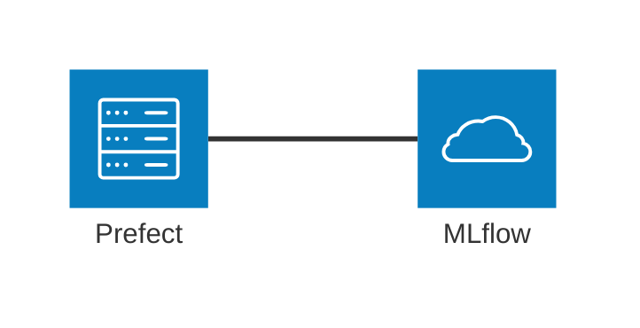
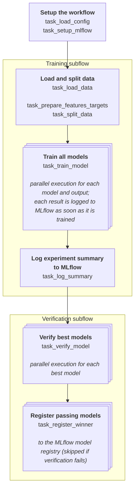

# Workflow architecture

The main architectural dependencies of this project are:

- [Prefect](https://www.prefect.io/) for workflow orchestration
- [MLflow](https://mlflow.org/) for experiment tracking and model registry

## Prefect workflows

Three Prefect workflows are defined (see `bonestrength_ml/workflows/flows.py`):

- `train_all_outputs_flow`: trains all models specified in the configuration file twice (once for each output variable);
- `train_single_output_flow`: trains all models specified in the configuration file for a single output variable (either `maxStrain_11` or `maxStrain_33`);
- `train_specific_model_flow`: trains a specific model for a specific output variable.

Let's take a closer look at the full workflow `train_all_outputs_flow`, which trains all models for both output variables. The other two workflows are simplified versions of this one.

Each `task_train_model` logs its own MLflow run (parameters, metrics, and the fitted model) as soon as that model finishes training, so runs become observable in parallel rather than only after the whole batch completes. Once every model has been trained, `task_log_summary` adds a single run comparing them all.

## CLI

The workflows are executed through a CLI defined in `bonestrength_ml/cli.py` using **Typer**. The **Rich** library is used to improve the CLI output.

## Configuration

Workflows in this project are configuration-driven.
The configuration is stored in `config/BoneStrengthML.yml`. A single configuration file drives all three workflows, specifying the dataset, the list of models to train, the optimization settings, and the verification tests and gate thresholds.
The configuration file is loaded and validated using **Pydantic** at the beginning of each workflow.

## Data loading and validation

Data is loaded from csv and validated using **Pandera**.