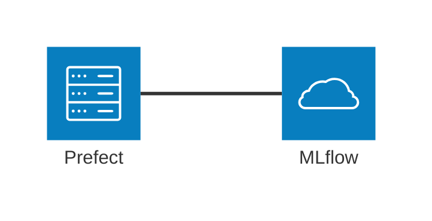
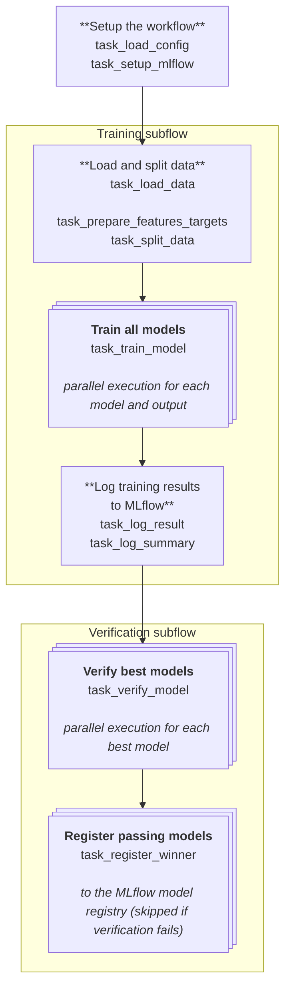

# Workflow architecture

The main architectural dependencies of this project are:

- [Prefect](https://www.prefect.io/) for workflow orchestration
- [MLflow](https://mlflow.org/) for experiment tracking and model registry

## Configuration

Prefect workflows are configuration-driven.

The configuration is stored in YAML files under the `config` directory (see `config/BoneStrengthML.yml`). A single configuration file drives all three workflows, specifying the dataset, the list of models to train, the optimization settings, and the verification tests and gate thresholds.

## Prefect workflows

Three Prefect workflows are defined (see `bonestrength_ml/workflows/flows.py`):

- `train_all_outputs_flow`: trains all models specified in the configuration file twice (once for each output variable);
- `train_single_output_flow`: trains all models specified in the configuration file for a single output variable (either `maxStrain_11` or `maxStrain_33`);
- `train_specific_model_flow`: trains a specific model for a specific output variable.

Let's take a closer look at the `train_all_outputs_flow` workflow:

